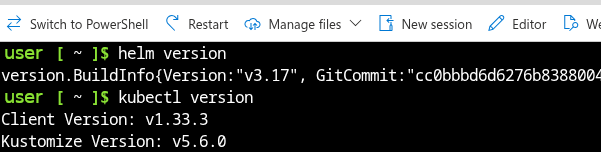
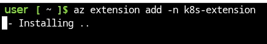

# Deploying Malcolm-Helm on Azure

Microsoft Azure is a comprehensive cloud computing platform and infrastructure created by Microsoft. It offers a wide range of cloud services, including those for computing, analytics, storage, and networking. Users can pick and choose from these services to develop and scale new applications, or run existing applications in the public cloud. Azure is designed to help businesses manage their cloud infrastructure, ensuring scalability, reliability, and security. It supports 
multiple programming languages, tools, and frameworks including the Microsoft Azure Kubernetes Service (AKS) where Malcolm-Helm can be deployed. 

## Connect to the Azure portal

We will assume you already have a Microsoft Azure account setup and funding in place to run cloud instances. If you have active Visual Studio subscription it may include [free credits](https://learn.microsoft.com/en-us/visualstudio/subscriptions/vs-azure-eligibility) to test Malcom-Helm in Azure AKS. 

Point your browser to the [Azure login portal](https://portal.azure.com) at: https://portal.azure.com. 
You should be prompted to login:


After authenticating you should see your Azure services home page with a list of resources, your subscription type and links to the various services available.


## Azure Cloud Shell

Rather than install the Kubernetes and Helm tools locally we will leverage the Azure Cloud Shell for command line operations. The cloud shell icon is located near the top-right corner of the Azure landing page.


Click the Cloud Shell icon to open a shell instance. A terminal emulator pane will open (usually at the bottom of the window)


The Kubernetes tools we will need, such as helm and kubectl, come pre-installed. We will assume you are using the bash implementation of Cloud Shell rather than the PowerShell interpreter.



We will need to generate an SSH key-pair in the Cloud Shell environment with:

```
ssh-keygen -t rsa -b 8192
```

Save the file to /home/{user}/.ssh/id_rsa (or just hit enter for the default) and don't set a passphrase for now. The command output should look similar to this:


There is also one extension we will need to add to the Azure "az" command for working with kubernetes using the following command:

```
az extension add -n k8s-extension
```

The output should look similar to this:



You can verify which extensions are installed with:

```
az extension list
```

The output should include the k8s-extension along with a few others


Now that we have confirmed access to the Azure environement and the Cloud Shell tools we can begin adding the necessary services

### Vagrant Quickstart with istio

Running vagrant with istio service mesh example instead of using RKE2 ingress.

1. Follow steps 1 through 5 in vagrant quickstart
2. run `VAGRANT_SETUP_CHOICE=use_istio vagrant up`
3. If using Windows edit C:\Windows\System32\drivers\etc\hosts with notepad as administrator
4. If using linx run `sudo vim /etc/hosts`
5. Add the entry `127.0.0.1 localhost malcolm.vp.bigbang.dev`
6. Open chrome and navigate to https://malcolm.vp.bigbang.dev:8443/readme
7. If the browser does not allow you to access the page. Either add the ca.crt generated to the webrowser or just click on the webbrowser and type `thisisunsafe`

## Listener NIC setup

If you want all the host traffic to be seen by the Malcolm-Helm VM running on your host machine execute the following instructions:

1. Open virtualbox 
2. Right click Malcolm-Helm VM and select settings
3. Select Network on the left colum
4. Select `Adapter 2` tab
5. Change Attached to `Bridged Adapter`
6. Select the Advanced drop down
7. Ensure Promisc mode is set to `Allow all` 
8. run `ssh -p 2222 vagrant@localhost` and login using vagrant as the password.
9. run `tcpdump -i enp0s8` to ensure traffic is getting piped through the iface.

## Production Cluster Requirements

The following requirements pertain to only a Kubernetes cluster you are standing up for production purposes.
The following requirements are assumed to be met prior to running the Installation procedures.  
Other Kuberenetes clusters may work but they have not been tested

- Kubernetes RKE2 installation v1.24.10+rke2r1
- Storage class that is capable of handling ReadWriteManyVolumes across all kubernetes nodes (IE: Longhorn) 
- TODO Storage class that is built for local / fast storage for the statefulsets. (We still need to convert Opensearch to statefulset as well as postgres for netbox.)
- Istio service mesh https://istio.io/latest/docs/setup/getting-started/
- TODO Support TLS with nginx ingress

### Label requirements

NOTE: The vagrant quick start handles and applies all these labels for you.
All primary server nodes should be labeled with `kubectl label nodes $node_name cnaps.io/node-type=Tier-1`.  Failure to do so will result in certain services like logstash to not be provisioned.

All sensor kubernetes nodes should be labeled with one or all of the following:
1. `kubectl label nodes $node_name cnaps.io/suricata-capture=true` 
2. `kubectl label nodes $node_name cnaps.io/zeek-capture=true`

Failure to add any of the above labels will result in suricata and zeek live pods to not get scheduled on those nodes.

## External Elasticsearch notes

Elasticsearch requires TLS termination in order for it to support Single Sign On (SSO) functionality.  The values file was updated to give 
the user of this helm chart the ability to copy the certificate file from a different namespace into Malcolm namespace for usage.

Furthermore, dashboards_url (IE kibana) is still expected to remain unencrypted when using Istio service mesh. 

## Installation procedures

Check the chart/values.yaml file for all the features that can be enabled disabled and tweaked prior to running the below installation commands.

1. `git clone <repo url>`
2. `cd <project dir that contains chart foler>`
3. `helm install malcolm chart/ -n malcolm`


## Storage Provisioner Options

Malcolm-Helm's chart/values.yaml file defaults to the Rancher [local-path](https://github.com/rancher/local-path-provisioner) storage provisioner which allocates storage from the Kubernetes nodes. As stated above, any storage provider that supports the ReadWriteMany access mode may be employed for Malcolm-Helm. This section will review how to configure the [nfs-subdir-external-provisioner](https://github.com/kubernetes-sigs/nfs-subdir-external-provisioner) for enviroments with an NFS server available. 

### Configure an NFS server

The [nfs-subdir-external-provisioner](https://github.com/kubernetes-sigs/nfs-subdir-external-provisioner) relies on an external NFS server to provide Kuberenetes Persistent Volumes. The first step is to install an NFS server where the Kuberentes cluster can access the NFS shared volumes. For Debian based systems (including Ubuntu) [this page](https://documentation.ubuntu.com/server/how-to/networking/install-nfs/index.html) details steps to install an NFS server with apt:

```
sudo apt install nfs-kernel-server
sudo systemctl start nfs-kernel-server.service
```

With the NFS service installed and running, a directory must be exported for use by the Kubernetes provisioner. In this example we export a directory for the nfs-subdir-provisioner by first creating a folder structure on the server's local filesystem then add that path to /etc/exports on the NFS server. To verify everything works properly we will start with fully-open directory permissions.

```
sudo mkdir -p /exports/malcolm/nfs-subdir-provisioner
sudo chown nobody:nogroup /exports
sudo chmod -R 777 /exports/malcolm/nfs-subdir-provisioner/
```

Add a new line to the NFS server's /etc/exports with the base path of our newly created /exports directory and an optional network subnet filter. In the following example we limit NFS access to IP addresses within the 10.0.0.0/16 subnet. This can also be replaced with an asterisk "*" symbol to disable subnet filtering.

```
/exports 10.0.0.0/255.255.0.0(rw,sync,insecure,no_root_squash,no_subtree_check,crossmnt)
```

Finally, apply the NFS configuration changes with the exportfs command

```
$ sudo exportfs -av
```
that command returns: 
> "exporting 10.0.0.0/255.255.0.0:/exports"

Optionally, we can verify the exported directory by querying the NFS server with showmount.

```
$ /usr/sbin/showmount -e nfsserver.malcolm.local
```
that command returns: 
> Export list for nfsserver.malcolm.local:
> /exports 10.0.0.0/255.255.0.0

Make note of your NFS server's IP address or DNS name and the exported path for use in the next steps.

### Install the nfs-client on all Kubernetes nodes

Since the Kubernetes pods will be making use of the NFS server export and the pods may run on any Kubernetes node we need the nfs client installed on all nodes. Connect to each machine and run the following commands:

```
sudo apt update
sudo apt install nfs-common -y
```

### Install the nfs-subdir-external-provisioner

The [nfs-subdir-exeternal-provisioner](https://github.com/kubernetes-sigs/nfs-subdir-external-provisioner) can be installed via Helm, Kustomize, or manually via a set of YAML files. Since Malcolm-Helm is a Helm based project we will also install the provisioner [via Helm](https://github.com/kubernetes-sigs/nfs-subdir-external-provisioner?tab=readme-ov-file#with-helm).

For these steps we will need the NFS server IP address or DNS name as well as the NFS exported path from above. In the following example the server's DNS name is "nfsserver.malcolm.local" and the exported path on that server is "/exports/malcolm/nfs-subdir-provisioner". Notice: the NFS server's export path is actually /exports but we can point the nfs-subdir-external-provisioner to a sub-directory within the exported path (/exports/malcolm/nfs-subdir-provisioner) to keep the automatically generated files contained to that directory. We start by adding the Helm repo then install the provisioner with the server name and exported path as parameters.
 
```
$ helm repo add nfs-subdir-external-provisioner https://kubernetes-sigs.github.io/nfs-subdir-external-provisioner/
$ helm install nfs-subdir-external-provisioner nfs-subdir-external-provisioner/nfs-subdir-external-provisioner \
    --set nfs.server=nfsserver.malcolm.local \
    --set nfs.path=/exports/malcolm/nfs-subdir-provisioner 
```

Check the Storage Class was successfully deployed to your Kubernetes cluster with the "get sc" command

```
$ kubectl get sc -A
```

returns:
<pre>
NAME                   PROVISIONER                                     RECLAIMPOLICY   VOLUMEBINDINGMODE      ALLOWVOLUMEEXPANSION   AGE
nfs-client             cluster.local/nfs-subdir-external-provisioner   Delete          Immediate              true                   16s
</pre>

You will see a new nfs-subdir-external-provisioner pod is now running in the default namespace

```
$ kubectl get pods -A
```

returns:
<pre>
NAMESPACE       NAME                                               READYs   STATUS              RESTARTS      AGE
default         nfs-subdir-external-provisioner-7ff748465c-ssf7s   1/1     Running             0             32s
</pre>

### Test the newly installed nfs-subdir-external-provisioner

Two YAML files are needed to test the provisioner configuration. The [first](https://raw.githubusercontent.com/kubernetes-sigs/nfs-subdir-external-provisioner/master/deploy/test-claim.yaml) defines a PersistentVolumeClaim that leverages the nfs-subdir-external-provisioner.

```
kind: PersistentVolumeClaim
apiVersion: v1
metadata:
  name: test-claim
spec:
  storageClassName: nfs-client
  accessModes:
    - ReadWriteMany
  resources:
    requests:
      storage: 1Mi
```
Note: the storageClassName is set to "nfs-client" which matches the output of the "kubectl get sc -A" command above.

 
The other [test file](https://raw.githubusercontent.com/kubernetes-sigs/nfs-subdir-external-provisioner/master/deploy/test-pod.yaml) defines a pod to make use of the newly created PersistentVolumeClaim.

```
kind: Pod
apiVersion: v1
metadata:
  name: test-pod
spec:
  containers:
  - name: test-pod
    image: busybox:stable
    command:
      - "/bin/sh"
    args:
      - "-c"
      - "touch /mnt/SUCCESS && exit 0 || exit 1"
    volumeMounts:
      - name: nfs-pvc
        mountPath: "/mnt"
  restartPolicy: "Never"
  volumes:
    - name: nfs-pvc
      persistentVolumeClaim:
        claimName: test-claim
```

This Pod definition lists "test-claim" in the volumes: section at the bottom of the file which matches the PersistentVolumeClaim's "name" field above and ties the two together.

Both of these test files are avalabile as part of the nfs-subdir-external-provisioner source code so we can deploy them directly from the GitHub links

```
kubectl create -f https://raw.githubusercontent.com/kubernetes-sigs/nfs-subdir-external-provisioner/master/deploy/test-claim.yaml -f https://raw.githubusercontent.com/kubernetes-sigs/nfs-subdir-external-provisioner/master/deploy/test-pod.yaml
```

returns:
<pre>
persistentvolumeclaim/test-claim created
pod/test-pod created
</pre>

Verify the PersistentVolumeClaim was created with the following command:
```
kubectl get pvc
```

returns:
<pre>
NAME         STATUS   VOLUME                                     CAPACITY   ACCESS MODES   STORAGECLASS   VOLUMEATTRIBUTESCLASS   AGE
test-claim   Bound    pvc-49649079-ffc5-402e-a6da-b3be50978e02   1Mi        RWX            nfs-client     <unset>                 100s
</pre>

The test-claim has a status of "Bound" so we should also see the test Pod running. Check that with the "get pods" command for the default namespace:
```
kubectl get pods -n default
```

returns:
<pre>
NAME                                               READY   STATUS      RESTARTS   AGE
nfs-subdir-external-provisioner-7ff748465c-q5hbl   1/1     Running     0          27d
test-pod                                           0/1     Completed   0          7m31s
</pre>

The PerstentVolumeClaim should make a new directory in the NFS export and the Pod is designed to exit after creating a "SUCCESS" file in that directory. The test-pod shows a status of "Completed" because the pod already started, created the file, and exited. Check the NFS directory to verify a new directory has been created and it contains a file named "SUCCESS".

<pre>
nfs-subdir-provisioner$ ls -al
total 0
drwxrwxrwx  3 1000  1000  81 Jan 15 09:58 .
drwxrwxrwx 10 1000  1000 213 Jan 18 08:02 ..
drwxrwxrwx  2 root  root  21 Jan 15 09:58 default-test-claim-pvc-20de4d0b-3e1c-4e7b-83c9-d6915a483328
</pre>

The directory should contain one file which was created when the Pod started.
<pre>
nfs-subdir-provisioner$ ls default-test-claim-pvc-20de4d0b-3e1c-4e7b-83c9-d6915a483328
SUCCESS
</pre>

Delete the Pod and the PersistentVolumeClaim using the same YAML files we used to create them:
```
kubectl delete -f https://raw.githubusercontent.com/kubernetes-sigs/nfs-subdir-external-provisioner/master/deploy/test-claim.yaml -f https://raw.githubusercontent.com/kubernetes-sigs/nfs-subdir-external-provisioner/master/deploy/test-pod.yaml

```

returns:
<pre>
persistentvolumeclaim "test-claim" deleted
pod "test-pod" deleted
</pre>

The NFS directory will be renamed as "archived-default-test-claim-pvc...." and can be manually deleted.

```
rm -rf archived-default-test-claim-pvc-20de4d0b-3e1c-4e7b-83c9-d6915a483328/
```


### Configure Malcolm-Helm to use the nfs-subdir-external-provisioner
Now that we know the NFS server exports are configured correctly, and the Kubernetes nfs-subdir-external-provisioner is able to access those for PersistentVolumeClaims, we are ready to configure Malcolm-Helm for deployment. As stated above, the Malcolm-Helm [values.yaml file](https://github.com/idaholab/Malcolm-Helm/blob/e29ad656f9f86c59011b319efb6538b4f9807c63/chart/values.yaml#L222) defaults to the [Rancher local-path](https://github.com/rancher/local-path-provisioner) storage provisioner.  We will need to change all of those values.yaml entries to "nfs-client" to leverage the nfs-subpath-external-provisioner and the NFS server exports. The storage: section of your values.yaml file should look like the following:

```
storage:
  # This helm chart requires a storage provisioner class it defaults to local-path provisioner
  # If your kuberenetes cluster has a different storage provisioner please ensure you change this name.
  # https://github.com/rancher/local-path-provisioner
  development:
    pcap_claim:
      # The size of the claim
      size: 25Gi
      # The kubernetes storage class name
      className: nfs-client
    zeek_claim:
      size: 25Gi
      className: nfs-client
    suricata_claim:
      size: 25Gi
      className: nfs-client
    config_claim:
      size: 25Gi
      className: nfs-client
    runtime_logs_claim:
      size: 25Gi
      className: nfs-client
    opensearch_claim:
      size: 25Gi
      className: nfs-client
    opensearch_backup_claim:
      size: 25Gi
      className: nfs-client
    postgres_claim:
      size: 15Gi
      className: nfs-client
  production:
    pcap_claim:
      size: 100Gi
      className: nfs-client
    zeek_claim:
      size: 50Gi
      className: nfs-client
    suricata_claim:
      size: 50Gi
      className: nfs-client
    config_claim:
      size: 25Gi
      className: nfs-client
    runtime_logs_claim:
      size: 25Gi
      className: nfs-client
    opensearch_claim:
      size: 25Gi
      className: nfs-client
    opensearch_backup_claim:
      size: 25Gi
      className: nfs-client
    postgres_claim:
      size: 15Gi
      className: nfs-client

```

Now follow the [Installation procedures](#installation-procedures) section above to deploy the Malcolm-Helm chart into your cluser.

```
1. `cd <project dir that contains chart foler>`
2. `helm install malcolm chart/ -n malcolm --create-namespace`
```

returns:
<pre>
NAME: malcolm
LAST DEPLOYED: Tue Jul 15 13:35:51 2025
NAMESPACE: malcolm
STATUS: deployed
REVISION: 1
TEST SUITE: None
</pre>

The Malcolm-Helm pods should all be Running after a few minutes:

<pre>
Malcolm-Helm$ kubectl get pods -n malcolm
NAME                                           READY   STATUS    RESTARTS   AGE
api-deployment-8685768bbd-8kr8x                1/1     Running   0          103s
arkime-deployment-7dbf5f99c5-nrgxm             1/1     Running   0          103s
dashboards-deployment-5897d7cfcf-nh9r6         1/1     Running   0          103s
dashboards-helper-deployment-758645fdc-vggnq   1/1     Running   0          101s
file-monitor-deployment-64c595db-2xwlp         1/1     Running   0          103s
filebeat-offline-deployment-596bb57f5b-4hl89   1/1     Running   0          103s
freq-deployment-bb49df764-frhqt                1/1     Running   0          103s
htadmin-deployment-7658bf6ff5-bwqqg            1/1     Running   0          101s
logstash-deployment-569899b584-758nw           1/1     Running   0          102s
netbox-deployment-654cb5598c-c58n8             1/1     Running   0          103s
nginx-proxy-deployment-5db4b75948-8ltpx        1/1     Running   0          103s
opensearch-0                                   1/1     Running   0          103s
pcap-monitor-deployment-84986f9ccc-wd45z       1/1     Running   0          103s
postgres-statefulset-0                         1/1     Running   0          103s
redis-cache-deployment-644f9947f4-6dwqk        1/1     Running   0          103s
redis-deployment-677476f956-782n4              1/1     Running   0          102s
suricata-offline-deployment-678fcdc985-mmj67   1/1     Running   0          103s
upload-deployment-6b458f89c7-k8hd8             1/1     Running   0          103s
zeek-offline-deployment-57c548c646-d86lw       1/1     Running   0          102s
</pre>

The PersistenVolumeClaims should be bound:

<pre>
Malcolm-Helm$ kubectl get pvc -n malcolm
NAME                                    STATUS   VOLUME                                     CAPACITY   ACCESS MODES   STORAGECLASS   VOLUMEATTRIBUTESCLASS   AGE
config-claim                            Bound    pvc-90dd6987-12c3-45d5-8acb-516db28e1104   25Gi       RWX            nfs-client     <unset>                 3m12s
opensearch-backup-claim-opensearch-0    Bound    pvc-b5534ea1-e370-4e71-b0fc-434773d34f9d   25Gi       RWO            nfs-client     <unset>                 3m12s
opensearch-claim-opensearch-0           Bound    pvc-cc824212-3ce0-40a2-9e41-3e630e3e9903   25Gi       RWO            nfs-client     <unset>                 3m12s
pcap-claim                              Bound    pvc-412ec10b-ea5d-46e6-8a6a-53aeb7109441   25Gi       RWX            nfs-client     <unset>                 3m12s
postgres-claim-postgres-statefulset-0   Bound    pvc-ba220505-d4d7-43b3-beaf-d15ec0dce900   15Gi       RWO            nfs-client     <unset>                 3m12s
runtime-logs-claim                      Bound    pvc-03dd17f9-18a4-4cc6-a2a0-a8a3d5986a7b   25Gi       RWX            nfs-client     <unset>                 3m12s
suricata-claim-offline                  Bound    pvc-5897418a-5801-4dac-9d4b-074d101fc3bd   25Gi       RWX            nfs-client     <unset>                 3m12s
zeek-claim                              Bound    pvc-c30307ae-41e2-4a02-aff2-8143a17128cb   25Gi       RWX            nfs-client     <unset>                 3m12s
</pre>

And you should see several sub-directories were created in the NFS server export directory:

<pre>
nfs-subdir-provisioner$ ls -al
total 4
drwxrwxrwx 11 1000  1000   4096 Jan 15 13:35 .
drwxrwxrwx 10 1000  1000   213 Jan 18 08:02 ..
drwxrwxrwx  8 root  root   116 Jan 15 13:35 malcolm-config-claim-pvc-90dd6987-12c3-45d5-8acb-516db28e1104
drwxrwxrwx  2 root  root   6 Jan 15 13:35 malcolm-opensearch-backup-claim-opensearch-0-pvc-b5534ea1-e370-4e71-b0fc-434773d34f9d
drwxrwxrwx  4 root  root   49 Jan 15 13:36 malcolm-opensearch-claim-opensearch-0-pvc-cc824212-3ce0-40a2-9e41-3e630e3e9903
drwxrwxrwx  4 root  root   49 Jan 15 13:35 malcolm-pcap-claim-pvc-412ec10b-ea5d-46e6-8a6a-53aeb7109441
drwxrwxrwx  3 root  root   22 Jan 15 13:36 malcolm-postgres-claim-postgres-statefulset-0-pvc-ba220505-d4d7-43b3-beaf-d15ec0dce900
drwxrwxrwx  3 root  root   27 Jan 15 13:35 malcolm-runtime-logs-claim-pvc-03dd17f9-18a4-4cc6-a2a0-a8a3d5986a7b
drwxrwxrwx  2 1000  1000   54 Jan 15 13:36 malcolm-suricata-claim-offline-pvc-5897418a-5801-4dac-9d4b-074d101fc3bd
drwxrwxrwx  7 root  root   109 Jan 15 13:35 malcolm-zeek-claim-pvc-c30307ae-41e2-4a02-aff2-8143a17128cb
</pre>


## Upgrade procedures

Upgrading Malcolm-Helm to a new version of Malcolm requires manually applying the changes between the current and desired versions. To find the current version of Malcolm used by Malcolm-Helm, check the `appVersion` in the `Malcolm-Helm/chart/Chart.yaml` file.

Here’s a step-by-step guide for upgrading Malcolm-Helm to a new version of Malcolm. The following example demonstrates an upgrade from version `24.07.0` to `24.10.0`, which is the latest release on Malcolm/main at the time of writing.

Step 1:
Checkout the Malcolm-Helm branch containing the current version of Malcolm (24.07.0)
Run the following command to checkout the relevant branch:
`git checkout Malcolm-Helm/main`

Step 2:
Checkout the Malcolm branch matching the current version in Malcolm-Helm (24.07.0)
Use this command to align your Malcolm repo with the version used in Malcolm-Helm:
`git checkout Malcolm/v24.07.0`

Step 3:
View the changes between the current version (v24.07.0) and the new desired version (main)
Compare the changes between these two versions to understand what updates need to be applied:
`git difftool -d v24.07.0..main`

Step 4:
Map changes to Malcolm-Helm files
For each change identified in Step 3, modify the corresponding files in Malcolm-Helm to reflect the updates. Ensure that all changes are accurately mirrored.

Step 5:
Test the updated Malcolm-Helm configuration
After mapping all changes, launch Dataplane's Malcolm instance to verify the upgrade. Ensure there are no breaking changes and that everything functions as expected.
