# Deploying Malcolm-Helm on Azure

Azure is a comprehensive cloud computing platform and infrastructure created by Microsoft. It offers a wide range of cloud services including those for computing, analytics, storage, and networking. Users can pick and choose from these services to develop and scale new applications or run existing applications in the public cloud. Azure is designed to help businesses manage their cloud infrastructure ensuring scalability, reliability, and security. It supports 
multiple programming languages, tools, and frameworks including the Microsoft Azure Kubernetes Service (AKS) where we will deploy Malcolm-Helm. 

## Connect to the Azure Portal

We will assume you already have a Microsoft Azure account setup and funding in place to run cloud instances. If you have active Visual Studio subscription it may include [free credits](https://learn.microsoft.com/en-us/visualstudio/subscriptions/vs-azure-eligibility) to test Malcom-Helm in Azure AKS. 

Point your browser to the [Azure login portal](https://portal.azure.com) at: https://portal.azure.com. 
You should be prompted to login:


After authenticating you should see your Azure services home page with a list of resources, your subscription type, and links to the various services available.

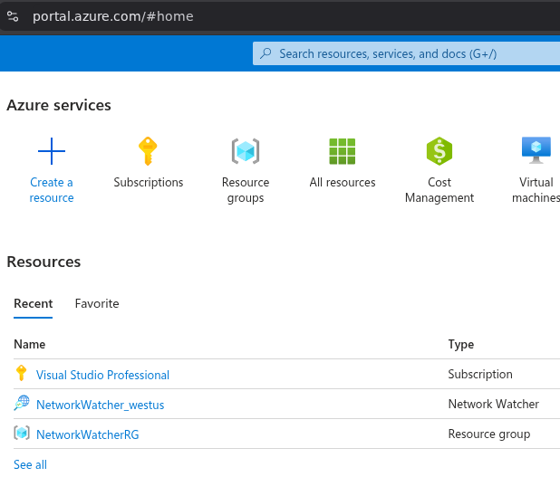

## Azure Cloud Shell

Rather than install the Kubernetes and Helm tools locally we will leverage the Azure Cloud Shell for command line operations. The cloud shell icon is located near the top-right corner of the Azure landing page.

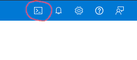

Click the Cloud Shell icon to open a shell instance. A terminal emulator pane will open (usually at the bottom of the window)


The Kubernetes tools we will need, such as helm and kubectl, come pre-installed. We will assume you are using the bash implementation of Cloud Shell rather than the PowerShell interpreter.


Generate a new SSH key-pair in the Cloud Shell environment with:

```
ssh-keygen -t rsa -b 8192
```

Save the newly generated key file to /home/{user}/.ssh/id_rsa (or just hit enter for the default) and don't set a passphrase for now. The command output should look similar to this:

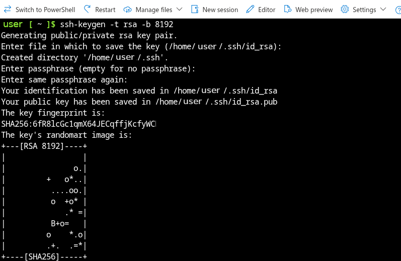

There is also one extension we will need to add to the Azure "az" command for working with Kubernetes by issuing the following command:

```
az extension add -n k8s-extension
```

The output should look like to this:


You can verify which extensions are installed with:

```
az extension list
```

The output will include the k8s-extension along with a few others. (Note: The extension is only installed on this instance of Cloud Shell and will need to be re-install each time you open a new Cloud Shell instance and start working with Malcolm-Helm)

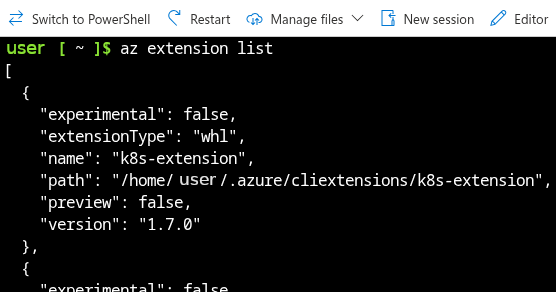

Now that we have confirmed access to the Azure environment and the Cloud Shell tools we can begin adding the necessary services.

### Add the Malcolm Helm Chart repository

Malcolm will be installed via the Helm Chart. First we need to add the repository to the local helm configuration with:

```
helm repo add malcolm https://raw.githubusercontent.com/idaholab/Malcolm-Helm/refs/heads/helm-repo/
```

The output will verify the name of the newly added repository


Verify the addition was successful by listing available helm repositories:

```
helm repo list
```

You should see the repository name and the URL we just provided

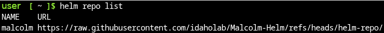

Update the catalog of available charts in the newly added repository.

```
helm repo update
```

You should see an "Update Complete" message when finished


Verify the list of available charts in a repository with the helm search repo command:

```
helm search repo malcolm
```

A list with the latest chart version should be displayed

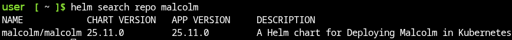


### Setup the Azure environment for running Malcolm

First we need to create an Azure Resource Group for the new Malcolm instance.  

```
az group create --location westus --resource-group MalcolmRG
```

The output will show the unique identifier for the newly created group along with other parameters

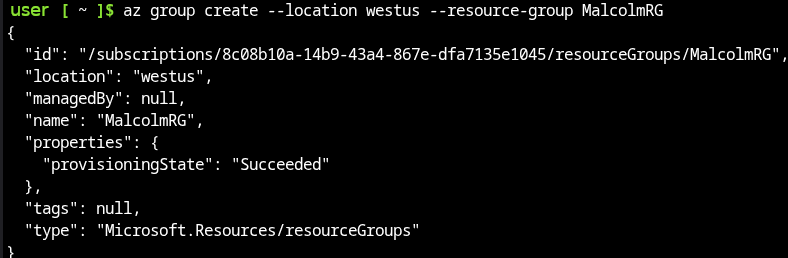

Verify the group was created by listing available groups.

```
az group list
```

The output will show the default "NetworkWatcherRG" automatically created by Azure as well as the newly created group.

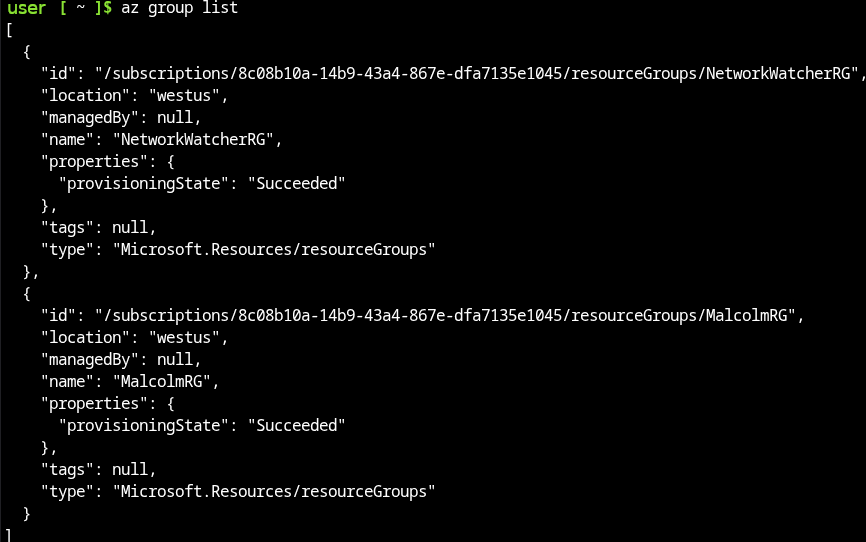

Now we can create a new Kubernetes cluster in the new resource group. For those with a limited Azure account, like those included with a Visual Studio subscription, we select a smaller node-vm-size that will fit within the account limits. Feel free to select a larger node size or more nodes if available.

```
az aks create -n MalcolmCluster -g MalcolmRG --node-vm-size Standard_B4as_v2 --node-count 3 --enable-blob-driver --ssh-key-value ~/.ssh/id_rsa.pub
```

This will take a few minutes while the output displays messages like "InProgress.." and "CreatingAgentPools: 0/3". When the cluster creation is complete a large amount of JSON information about the cluster properties will be displayed.


Next we need to get the authentication credentials from the newly created cluster so we can interact with it.

```
az aks get-credentials --resource-group MalcolmRG --name MalcolmCluster
```

The output will show where a configuration file has been written with the credentials.

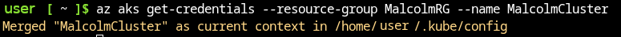

Finally, use the kubectl command to verify all of the Kuberenetes system pods are running before continuing with the Helm install

```
kubectl get pods -A
```

The output will list the Kuberenetes pods and their status. When all pods have a status of "Running" we can continue.


## Install Malcolm using Helm

We are now ready to install Malcolm using the newly configured Helm Repository. This requires tweaking the storage class to leverage a compatible Azure storage provider as well as specifying the creation of a LoadBalancer, rather than an ingress, for external access with the "--set" options. We will request a new Kubernetes namespace named "malcolm" and have Helm create that automatically. We have also limited the OpenSearch component to 5GB of Java memory to fit within the limits of the Azure Standard_B4as_v3 node selected in the cluster creation above. If your node size is not limited by your Azure account this can be modified or omitted.

```
helm install malcolm malcolm/malcolm -n malcolm --create-namespace --set "storage_class_name=azureblob-nfs-premium" --set "nginx.type=LoadBalancer" --set "ingress.enabled=false" --set opensearch.development.java_memory="-Xmx5g -Xms5g -Xss256k"
```

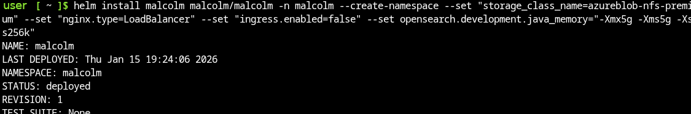

The Malcolm pods will be created. We can check their status with:

```
kubectl get pods -n malcolm
```

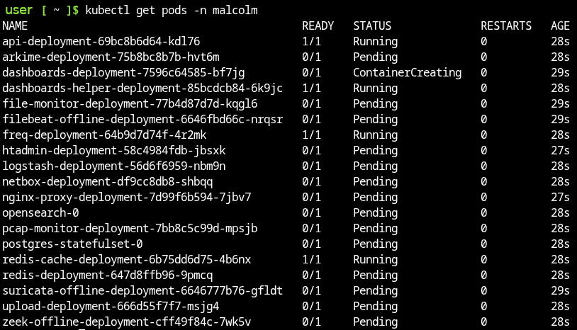


When all of the Malcolm pods are up and running we need to determine the public IP address that was assigned to the new LoadBalancer with:

```
kubectl get services -n malcolm
```

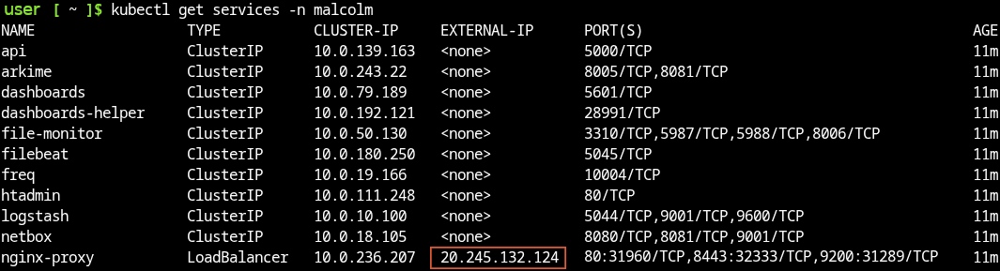

In the above screen-shot the External IP assigned to the nginx-proxy LoadBalancer component is 20.245.132.124. We need to use that address to test our new deployment in a browser. At this point the load balancer is listening on port 443 but Malcolm is not yet configured for TLS encryption so we need to use the HTTP protocol but over port 443 with the following URL:

```
http://20.245.132.124:443
```

Replace the "20.245.132.124" IP address with the output from your "kubectl get services -n malcolm" command above and enter that into your browser. You should be prompted to log into Malcolm. The default username and password setup in the Helm chart are both "malcolm".


Successfully logging in will take you to the Malcolm landing page with links to the various components like OpenSearch Dashboads, Arkime, NetBox and CyberChef


It may take some time for the OpenSearch component to initialize. Everything should be up and running when the dashboards switch to the dark theme with a navigation pane for the various visualizations.

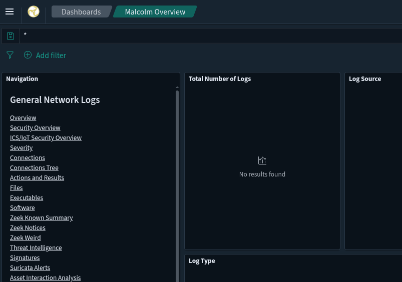


## Un-Install Malcolm using Helm

When finished, Malcolm can be uninstalled with the following helm command:

```
helm delete malcolm -n malcolm
```


Helm had previously created a "malcolm" namespace which can be manually removed with:

```
kubectl delete namespace malcolm
```
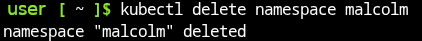

We can also remove the Azure Kubernetes cluster that was previously created. It will ask you to verify the deletion before proceeding.

```
az aks delete -n MalcolmCluster -g MalcolmRG
```


Finally, we can remove the Azure Resource Group that was created for the cluster. Again, it will ask you to verify the deletion before proceeding.

```
az group delete -n MalcolmRG
```

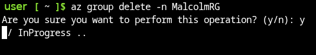


